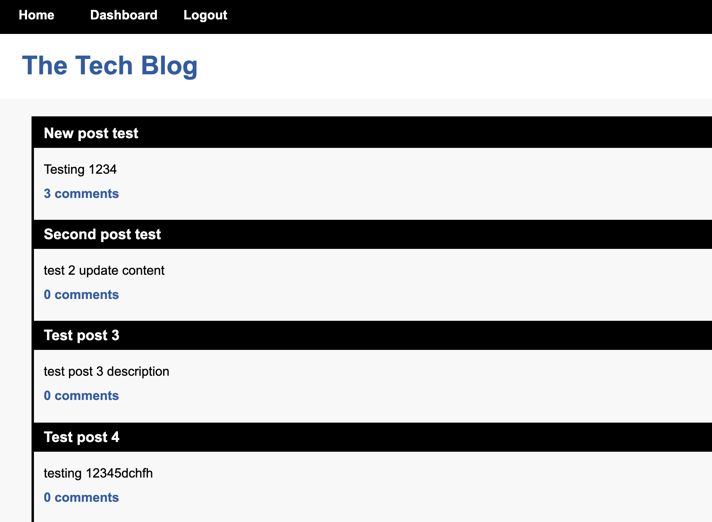

# mvc-tech-blog

## Description
A CMS-style blog site where developers can create posts and comment.
Users can add posts after creating an account and logging in.

Deployed on Heroku: 
https://mc-tech-blog.herokuapp.com/

## Technologies Used
* Javascript
* HTML
* CSS
* Handlebars
* MySQL
* Sequelize
* Bcrypt
* Express
* JawsDB
